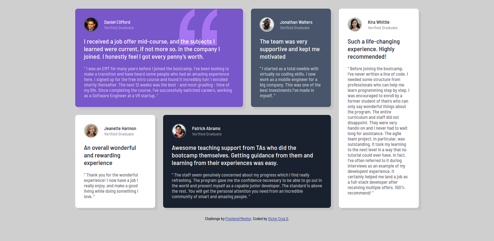

# FrontEnd Mentor Challenges

Those are my solution to challenges in [Fronten Mentor](https://www.frontendmentor.io/)

## 3 Column preview card.

This is my solution to the [3-column preview card component challenge on Frontend Mentor](https://www.frontendmentor.io/challenges/3column-preview-card-component-pH92eAR2-).

### Links

[Preview on Github Pages](https://vicc30.github.io/frontend-mentor-challenges/3-column-preview-card/)

[Github Repo](https://github.com/vicc30/frontend-mentor-challenges/tree/main/3-column-preview-card)

### Screenshots

Web version

Mobile version

## Testimonial grid

This is my solution to the [Testimonials grid section challenge on Frontend Mentor](https://www.frontendmentor.io/challenges/testimonials-grid-section-Nnw6J7Un7).

### Links

[Preview on Github Pages](https://vicc30.github.io/frontend-mentor-challenges/3-column-preview-card/)

[Github Repo](https://github.com/vicc30/frontend-mentor-challenges/tree/main/3-column-preview-card)

### Screenshots

Web version

Mobile version

